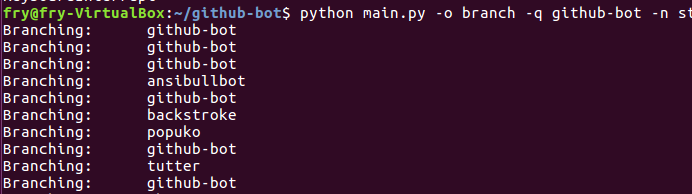
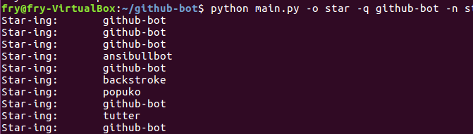

# github-bot
Easy bot for star-ing or branch-ing a bunch of repositories given a query. Using [pyGithub](http://pygithub.readthedocs.io/en/latest/introduction.html) library.


## Usage

**Branch repos containing a query (-q):**

```
python main.py -u {USERNAME} -p {PASSWORD} -o branch -q {QUERY}
```


**Star repos containing a query (-q):**

```
python main.py -u {USERNAME} -p {PASSWORD} -o star -q {QUERY}
```


## Examples







## Requirements

Python 2.x:

```
pip install -r install/requirements.txt
```

Python 3.x:

```
pip3 install -r install/requirements.txt
```

## Note

Tested both in Python2.x (2.7.15rc1) and Python 3.x (3.6.7)
